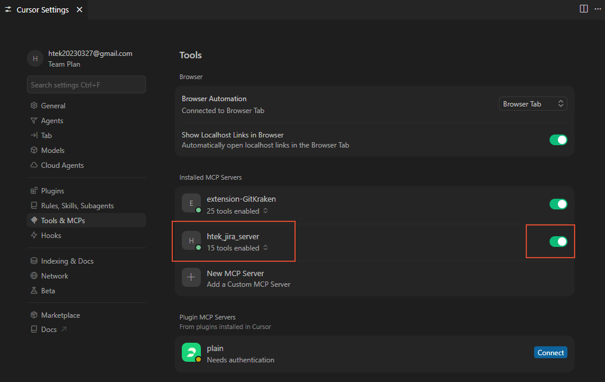

# Htek Jira 安装与使用说明

## 1. 说明

本文档只聚焦安装与接入步骤。

如果你想先了解项目结构、目录约定、关键文件和整体说明，请先阅读：

- [README.md](../README.md)

## 2. 通用安装步骤

推荐优先级如下：

- 方式 A：直接使用 [JiraMCPInstaller.exe](output/JiraMCPInstaller.exe)
- 方式 B：使用 [JiraMCPInstallerGUI.exe](output/JiraMCPInstallerGUI.exe)
- 方式 C：使用 [setup-jira-agent.ps1](build/setup-jira-agent.ps1)

### 方式 A：使用 JiraMCPInstaller.exe 安装

适用场景：

- 需要最稳妥的安装方式
- 希望直接看到控制台输出，便于排障
- 适合技术同事自行安装

使用方法：

1. 打开目录：
   `install/output/`
2. 双击运行：
   [JiraMCPInstaller.exe](output/JiraMCPInstaller.exe)
3. 按提示输入：
   Jira 地址、用户名、密码
4. 选择目标 agent：
   `Codex`、`Cursor`、`OpenClaw`、`Hermes`
5. 选择是否导入 skill
6. 如果目标是 `Cursor`，继续选择：
   `项目级配置` 或 `全局配置`

说明：

- 这是控制台版安装器
- 安装过程中的详细输出会直接显示出来
- 如果安装失败，优先建议先用这个版本排障

### 方式 B：使用 JiraMCPInstallerGUI.exe 安装

适用场景：

- 希望同事直接双击安装
- 希望使用图形界面表单输入配置
- 适合非技术同事或批量分发使用

使用方法：

1. 打开目录：
   `install/output/`
2. 确保以下两个文件在同一目录下：
   [JiraMCPInstaller.exe](output/JiraMCPInstaller.exe)
   [JiraMCPInstallerGUI.exe](output/JiraMCPInstallerGUI.exe)
3. 双击运行：
   [JiraMCPInstallerGUI.exe](output/JiraMCPInstallerGUI.exe)
4. 在界面中填写：
   仓库路径、Jira 地址、用户名、密码
5. 选择目标 agent、是否导入 skill，以及 Cursor 安装范围
6. 点击 `Install`

说明：

- GUI 版会优先调用同目录下的控制台版安装器
- 所以分发时最好把两个 `exe` 一起发给同事
- 如果图形界面安装失败，建议回退到 `JiraMCPInstaller.exe`

### 方式 C：使用 setup-jira-agent.ps1 安装

推荐命令：

```powershell
powershell -ExecutionPolicy Bypass -File .\install\build\setup-jira-agent.ps1
```

安装器会依次提示你：

1. 输入 Jira 地址
2. 输入 Jira 用户名
3. 输入 Jira 密码
4. 选择当前 agent
   支持：`Codex`、`Cursor`、`OpenClaw`、`Hermes`
5. 选择是否导入 skill
6. 如果选择 `Cursor`，继续选择：
   `项目级配置` 或 `全局配置`

说明：

- 勾选「导入 Jira skills」时：**Codex** 会复制到 `~/.codex/skills`；**OpenClaw** 会在 `~/.openclaw/openclaw.json` 中把本仓库的 `skills/` 加入 `skills.load.extraDirs`（[OpenClaw 文档](https://docs.openclaw.ai/tools/skills-config)），与仅复制到 Codex 的用法不同、效果等价。
- `Cursor`、`Hermes` 会安装 Jira MCP，但安装器**不会**为它们注册上述 skill 目录，请用 `docs/` 内 Prompt 模板等自行配置。

适用场景：

- 需要通过脚本参数做自动化安装
- 需要开发、调试或扩展安装逻辑
- 需要查看或修改安装源码

如果你想重新打包 `exe`，请查看：

- [EXE打包说明.md](build/EXE%E6%89%93%E5%8C%85%E8%AF%B4%E6%98%8E.md)

## 3. 如何检查 4 个 Agent 中 `htek_jira_server` MCP 是否已安装成功

本仓库安装器在「目标 agent」中可选：`Codex`、`Cursor`、`OpenClaw`、`Hermes`（见上文「通用安装步骤」）。下面按同一套思路做验收：配置文件是否已写入 → 本机/进程能否读到 Jira 环境变量（安装器在 **Windows** 上写入**用户级**的 `HTEK_JIRA_BASE_URL` / `HTEK_JIRA_USERNAME` / `HTEK_JIRA_PASSWORD`） → 在对应应用内重启后做一次能力验证（自然语言、界面或命令行）。`JiraMCPInstaller.exe`、`JiraMCPInstallerGUI.exe` 与 `install/build/setup-jira-agent.ps1` 目前**仅针对 Windows**；**macOS、Linux 不支持用本仓库安装器完成上述自动化**，需在各自系统上自行设置与 `jira_server_mcp.py` 相同的环境变量，并手工编辑各 Agent 的配置文件。本文以下路径、PowerShell 示例与「重新登录」等说明均以 **Windows** 为准。

### 3.1 与四个 Agent 共用的前置条件

- **Python 可用**：`python` 在 PATH 中可执行，且能跑安装器指定的 `jira_server_mcp.py`。
- **Jira 环境变量**：在**新的** PowerShell 中执行（与安装器同一会话/系统用户）：

  ```powershell
  echo $env:HTEK_JIRA_BASE_URL
  echo $env:HTEK_JIRA_USERNAME
  echo $env:HTEK_JIRA_PASSWORD
  ```

  三行都应有非空值；若全空，请先重新登录 Windows 或新开终端后再试（用户级环境变量在已启动的进程里需刷新后生效）。

- **MCP 脚本与仓库位置**：安装时选择的「Jira MCP 项目根目录」若以后移动了，**Cursor 全局、OpenClaw、Hermes** 的 JSON/YAML 里**脚本路径**需同步为新的绝对路径；**Codex** 与 **Cursor 项目级** 分别依赖 `config.toml` / `args` 中的路径或 `${workspaceFolder}`，需自行对照（安装器写入与 [setup-jira-agent.ps1](build/setup-jira-agent.ps1) 中 `Ensure-CodexConfig` / `Ensure-CursorConfig` 等实现一致）。

### 3.2 Codex Desktop

- **要检查的文件**：`%USERPROFILE%\.codex\config.toml`（即 `~/.codex/config.toml`）。
- **应存在的片段**（`args` 中的路径应对为你本机该仓库的 `jira_server_mcp.py`）：

  ```toml
  [mcp_servers.htek_jira_server]
  command = "python"
  args = ["<仓库绝对路径>\\tools\\jira_server_mcp.py"]
  enabled = true
  ```

- **算安装成功的表现**：修改后**已重启** Codex Desktop，在对话里能正常调用与 Jira 相关的能力（或执行下文「3.6 自然语言试跑」的示例）。**Jira skills** 是否安装成功见 **§4.1**。

### 3.3 Cursor

- **要检查的文件**（与安装时选的「项目级 / 全局」一致）：
  - 项目级：`<仓库根>\.cursor\mcp.json`；
  - 全局：`%USERPROFILE%\.cursor\mcp.json`。
- **应存在的结构**（`mcpServers.htek_jira_server`；项目级为 `${workspaceFolder}/...`，全局为**仓库内脚本的绝对路径**；安装器默认不写入 `env` 块，凭用户级 Jira 环境变量即可，与 `Ensure-CursorConfig` 一致）：

  ```json
  {
    "mcpServers": {
      "htek_jira_server": {
        "command": "python",
        "args": ["<项目级为 workspaceFolder 相对路径 或 全局为绝对路径>/tools/jira_server_mcp.py"]
      }
    }
  }
  ```

- **算安装成功的表现**：
  - 修改配置后**已重启** Cursor；
  - 在 **「Settings -> Tools & MCPs」** 的 MCP 列表中能看到 `htek_jira_server`（项目级：用 Cursor 打开该仓库根目录时可见；全局：任意工作区下通常都可见）；
  - 若本机已安装 **Cursor CLI**，可执行（确认列表与工具与官方版本一致）：

  ```powershell
  cursor-agent mcp list
  cursor-agent mcp list-tools htek_jira_server
  ```

- **示例图**（界面可见 MCP 时）：

  

- **项目级 / 全局对照**（可选）：安装范围说明可参考 [项目级和全局安装MCP](images/项目级和全局安装MCP.png)。**Jira skills**：本安装器不支持在 Cursor 自动安装，见 **§4.2**。

### 3.4 OpenClaw

- **要检查的文件**：`%USERPROFILE%\.openclaw\openclaw.json`（即 `~/.openclaw/openclaw.json`）。
- **应存在的结构**（安装器写入在 `mcp.servers.htek_jira_server` 下，与 `Ensure-OpenClawConfig` 一致）：

  ```json
  "mcp": {
    "servers": {
      "htek_jira_server": {
        "command": "python",
        "args": [ "<仓库绝对路径>/tools/jira_server_mcp.py" ]
      }
    }
  }
  ```

- **算安装成功的表现**：保存后按 OpenClaw 文档**重启/重载 MCP**（以你使用的版本为准），确认可以连接 `htek_jira_server`，并能在对话中执行下文章节「3.6」的 Jira 类试跑。**Jira skills** 是否安装成功见 **§4.3**。

### 3.5 Hermes

- **要检查的文件**：`%USERPROFILE%\.hermes\config.yaml`（即 `~/.hermes/config.yaml`）。
- **应存在的片段**（`args` 为到 `jira_server_mcp.py` 的绝对路径，与 `Ensure-HermesConfig` 一致）：

  ```yaml
  mcp_servers:
    htek_jira_server:
      command: "python"
      args:
        - "<仓库绝对路径>/tools/jira_server_mcp.py"
  ```

- **算安装成功的表现**：按 Hermes 使用说明**重启 Hermes 或执行其 `/reload-mcp` 等重载**后，在界面或提示中可确认 Jira MCP 已加载，并能完成 3.6 的试跑。**Jira skills**：本安装器不支持，见 **§4.4**。

### 3.6 自然语言试跑（四 Agent 通用）

在目标 Agent 的对话/Agent 里任选其一（或都试），若**能正常返回**而不报「缺少 MCP、无法连接、工具不存在」等错误，可认为**接入链路基本可用**：

```text
列出我当前能访问的 Jira 项目
```

```text
查看 RDTASK 最近 7 天更新的任务
```

注意：本节只验证 **MCP**；各 Agent 上 **Jira skills** 是否就绪见 **§4**。

## 4. 如何检查 4 个 Agent 中 Jira skills 是否安装成功

本仓库安装器在勾选「导入 Jira skills」时的行为（与 [setup-jira-agent.ps1](build/setup-jira-agent.ps1) 中 `Install-CodexSkills`、`Ensure-OpenClawConfig -ImportSkills` 一致）：

- **Codex**：将仓库 `skills/` **复制**到 `~/.codex/skills`。
- **OpenClaw**：在 `~/.openclaw/openclaw.json` 的 **`skills.load.extraDirs`** 中加入本仓库 `skills/` 的绝对路径（不复制文件）。
- **Cursor / Hermes**：**当前安装器不支持**为二者自动注册本仓库的 Jira skills；请使用 `docs/` 下 Prompt 模板或各产品自带的 Rules / 知识库自行编排。**后续若增加官方支持，再更新本节。**

### 4.1 Codex Desktop

- **要检查的目录**：`%USERPROFILE%\.codex\skills\`（即 `~/.codex/skills/`）。
- **应存在的内容**：与仓库 `skills/` 同名的子目录，且每个目录内有 `SKILL.md`，至少包括：
  - `jira-server-status-report`
  - `jira-server-spec-to-backlog`
  - `jira-server-triage-issue`
  - `jira-server-meeting-to-tasks`
- **PowerShell 快速检查**（存在即表示复制安装到位）：

  ```powershell
  Get-ChildItem "$env:USERPROFILE\.codex\skills" -Directory | Select-Object Name
  Test-Path "$env:USERPROFILE\.codex\skills\jira-server-status-report\SKILL.md"
  ```

- **算安装成功的表现**：**重启** Codex Desktop 后，在对话中可尝试使用 [HtekJira Skills中文Prompt模板.md](../docs/HtekJira%20Skills%E4%B8%AD%E6%96%87Prompt%E6%A8%A1%E6%9D%BF.md) 中的 **`$jira-server-status-report`** 等调用；若模型能按 skill 工作流执行（且 **§3** 中 MCP 已就绪），可认为 skills 与 MCP 链路均可用。

### 4.2 Cursor

- **结论**：**本仓库安装器当前不支持在 Cursor 中自动安装上述 Jira skills**（安装时勾选「导入 skills」对 Cursor 不生效，见 `setup-jira-agent.ps1` 中 Cursor 分支说明）。
- **验收方式**：不适用「是否已安装本仓库 skills」这一项；请用 **§3.3** 验证 **MCP**，并用 `docs/` 内 Prompt 模板手工编排。**后续若提供 Cursor 侧 skills/rules 一键安装，本节再补充。**

### 4.3 OpenClaw

- **要检查的文件**：`%USERPROFILE%\.openclaw\openclaw.json`。
- **应存在的结构**（仅在安装时勾选了「导入 Jira skills」时由安装器写入，与 `Add-OpenClawSkillsExtraDir` 一致）：

  ```json
  "skills": {
    "load": {
      "extraDirs": ["<仓库绝对路径>/skills"]
    }
  }
  ```

  `extraDirs` 中路径须仍指向**当前**本机上的仓库 `skills` 目录（正斜杠）；仓库若整体移动，需**重跑安装并勾选导入**或手改该路径。加载规则见 [OpenClaw skills 文档](https://docs.openclaw.ai/tools/skills-config)。

- **算安装成功的表现**：**重启或重载** OpenClaw 后，在客户端中能看到本仓库各 `SKILL.md` 对应的技能（具体入口以所用 OpenClaw 版本为准）；再结合 **§3.6** 或 `docs/HtekJira Skills中文Prompt模板.md` 中的 **`$jira-server-status-report`** 等做一次试跑（前提：**§3.4** 中 `htek_jira_server` MCP 已配置）。

### 4.4 Hermes

- **结论**：**本仓库安装器当前不支持在 Hermes 中自动安装上述 Jira skills**；Hermes 侧仅维护 **MCP**（见 **§3.5**）。
- **验收方式**：不适用「是否已安装本仓库 skills」；请仅按 **§3.5** 验证 MCP。**后续若 Hermes 增加与本仓库对齐的 skills 安装路径，本节再补充。**

### 4.5 自然语言试跑（仅适用于已安装 skills 的 Agent）

在 **Codex** 或 **OpenClaw**（且 **§4.1 / §4.3** 已满足）中，可选用与 **§3.6** 相同或 [HtekJira Skills中文Prompt模板.md](../docs/HtekJira%20Skills%E4%B8%AD%E6%96%87Prompt%E6%A8%A1%E6%9D%BF.md) 中的 **`$jira-server-status-report`** 等示例；**Cursor / Hermes** 请改用「直接说明要用 Jira MCP 列出项目 / 搜索 issue」等表述，不要求 `$` skill 名。

## 5. 故障排查

### 问题 1：Codex 看不到 Jira MCP

检查：

1. `~/.codex/config.toml` 中是否已有：

```toml
[mcp_servers.htek_jira_server]
command = "python"
args = ["<仓库路径>\\tools\\jira_server_mcp.py"]
enabled = true
```

2. 是否已经重启 Codex Desktop

### 问题 2：Cursor 看不到 Jira MCP

检查：

1. `.cursor/mcp.json` 或 `%USERPROFILE%\\.cursor\\mcp.json` 是否已正确配置
2. `command` 是否可直接执行 `python`
3. `args` 中的 `jira_server_mcp.py` 路径是否正确
4. 当前终端里是否能读取到以下环境变量：

```powershell
echo $env:HTEK_JIRA_BASE_URL
echo $env:HTEK_JIRA_USERNAME
echo $env:HTEK_JIRA_PASSWORD
```

5. 是否已经重启 Cursor

### 问题 3：连接 Jira 失败

检查：

1. 是否在公司内网环境
2. 是否开启了会影响内网访问的 VPN
3. Jira 用户名密码是否正确

### 问题 4：创建 issue 报缺字段

说明：

- 不同项目的 issue type 有不同必填字段

处理建议：

1. 先查看 issue type
2. 再查看字段元数据
3. 补齐字段后再创建

## 6. 推荐阅读

- [README.md](../README.md)
- [EXE打包说明.md](build/EXE%E6%89%93%E5%8C%85%E8%AF%B4%E6%98%8E.md)
- [HtekJira MCP使用SOP.md](../docs/HtekJira%20MCP%E4%BD%BF%E7%94%A8SOP.md)
- [HtekJira内部标准Prompt模板.md](../docs/HtekJira%E5%86%85%E9%83%A8%E6%A0%87%E5%87%86Prompt%E6%A8%A1%E6%9D%BF.md)
- [HtekJira分部门Prompt模板.md](../docs/HtekJira%E5%88%86%E9%83%A8%E9%97%A8Prompt%E6%A8%A1%E6%9D%BF.md)
- [HtekJira Skills中文Prompt模板.md](../docs/HtekJira%20Skills%E4%B8%AD%E6%96%87Prompt%E6%A8%A1%E6%9D%BF.md)
